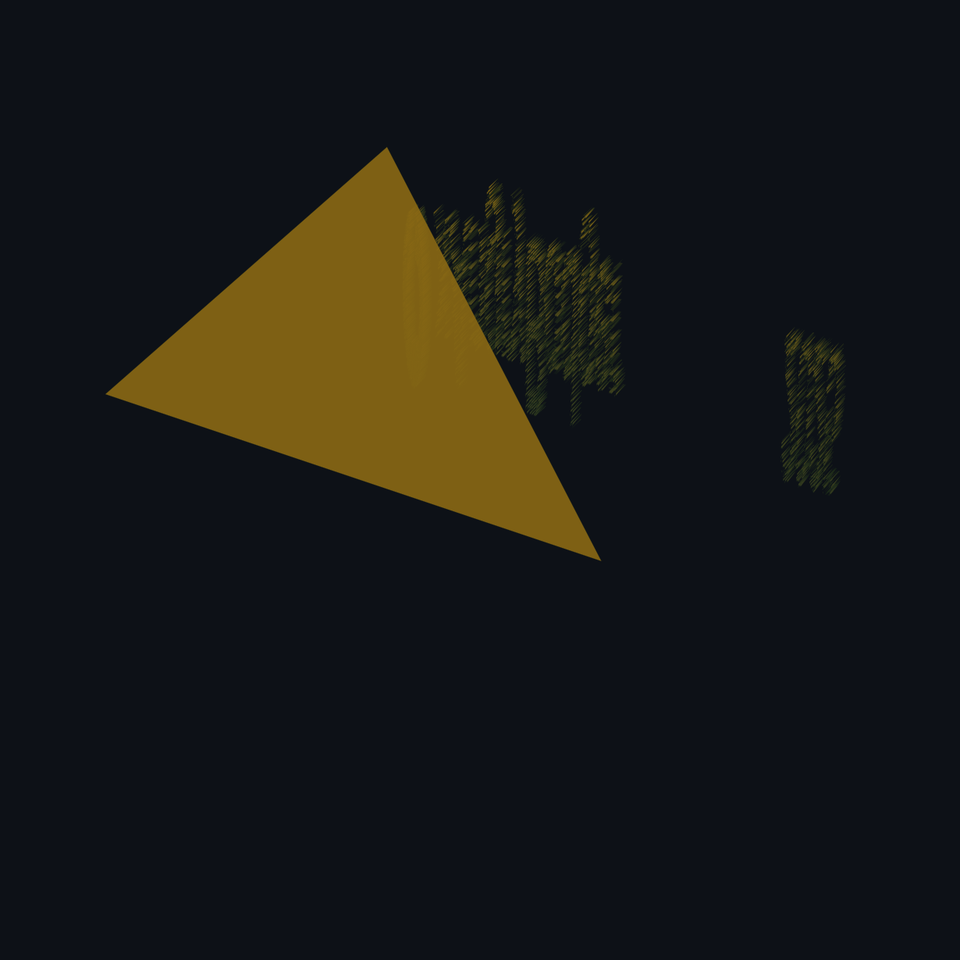

 

<!-- HERO GIF PLACEHOLDER — Replace with your own GIF/video -->
<!--  -->

  

---

### 🇧🇷 PT

Engenheiro de Computação em formação focado na intersecção entre **IA Generativa**, **Cloud Azure** e **desenvolvimento Full-Stack**. Construí pipelines agentic com 7+ modelos de IA, migrei bancos em larga escala para Azure Cosmos DB e entreguei apps offline-first para campo.

Quando não estou codando, estou com meus dois cachorros (uma Chow Chow e um Border Collie), consumindo conteúdo de desenvolvimento pessoal, ou ricing meu CachyOS/Hyprland.

### 🇺🇸 EN

Computer Engineering student focused on the intersection of **Generative AI**, **Azure Cloud**, and **Full-Stack development**. Built agentic pipelines with 7+ AI models, migrated large-scale databases to Azure Cosmos DB, and delivered offline-first field apps.

When I'm not coding, I'm with my two dogs (a Chow Chow and a Border Collie), following personal development content, or ricing my CachyOS/Hyprland setup.

---

---

---

---

---

---

<picture>
  <source media="(prefers-color-scheme: dark)" srcset="assets/github-snake-dark.svg" />
  <source media="(prefers-color-scheme: light)" srcset="assets/github-snake.svg" />
  
</picture>

---

---

| | Projeto | Stack | |
|:---:|:---|:---|:---:|
| 🦅 | **[HarpIA](https://github.com/xAngryBadger/harpia)** — Motor de automação criativa com 7+ modelos de IA | Python · GPT-4.1 · DALL-E 3 · Flux · Sora · Veo · Azure Cosmos DB | `6.9K+ loc` |
| 🌲 | **[SRF System](https://github.com/xAngryBadger/srf-system)** — Motor de planejamento para restauração florestal | Python · NiceGUI · Rich CLI · pandas · openpyxl | `planning` |
| 📱 | **[Flora Sensus](https://github.com/xAngryBadger/flora-sensus)** — App Flutter offline-first para inventário florestal | Flutter · Dart · Drift/SQLite · React · PocketBase | `24.6K+ loc` |
| 🦊 | **[Fennec Excel](https://github.com/xAngryBadger/Sahara-Fenneck)** — Assistente de IA local para Excel via Ollama | Python · Ollama · CustomTkinter · xlwings · ReAct | `desktop` |
| 🤖 | **[MaineCoon](https://github.com/xAngryBadger/minepal)** — Bot Minecraft com comandos em linguagem natural via LLM | Node.js · mineflayer · NVIDIA NIM API · RL | `gaming` |

---

📈 **7+ modelos de IA integrados** · 🌐 **Bilingual PT/EN** · 🐧 **CachyOS/Hyprland daily driver**

 

